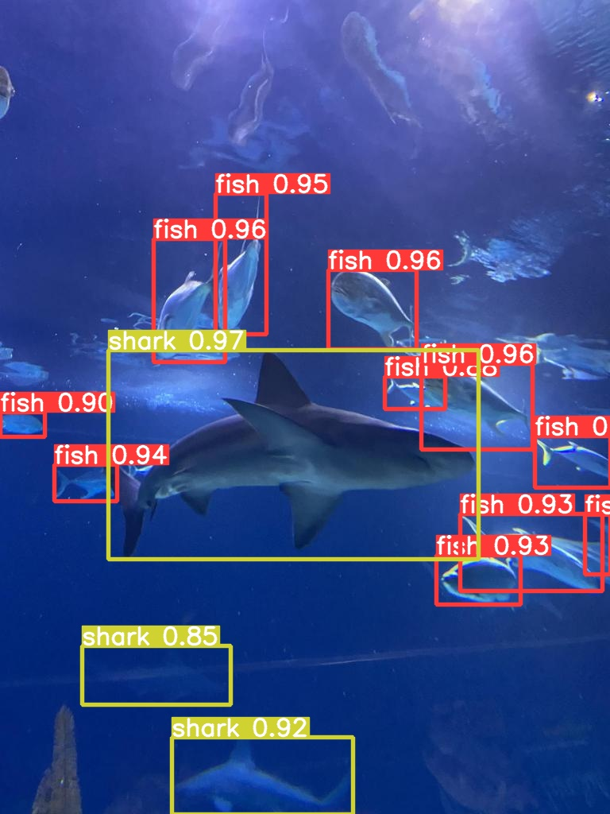
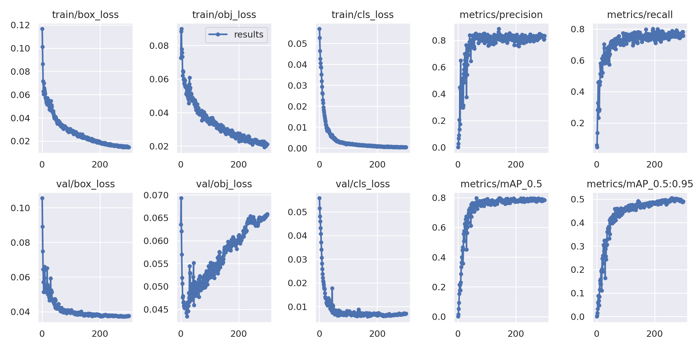
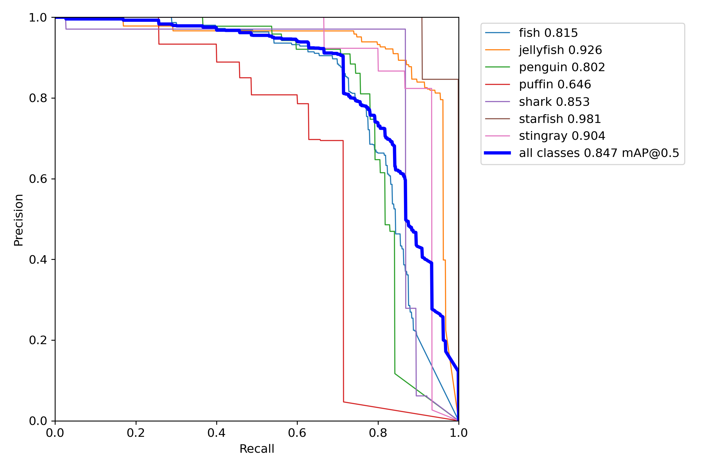
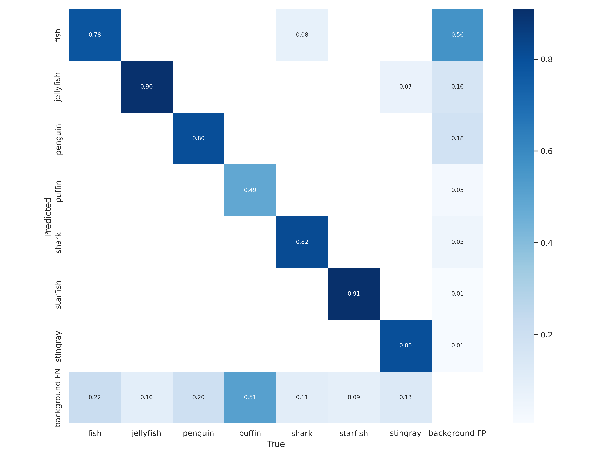
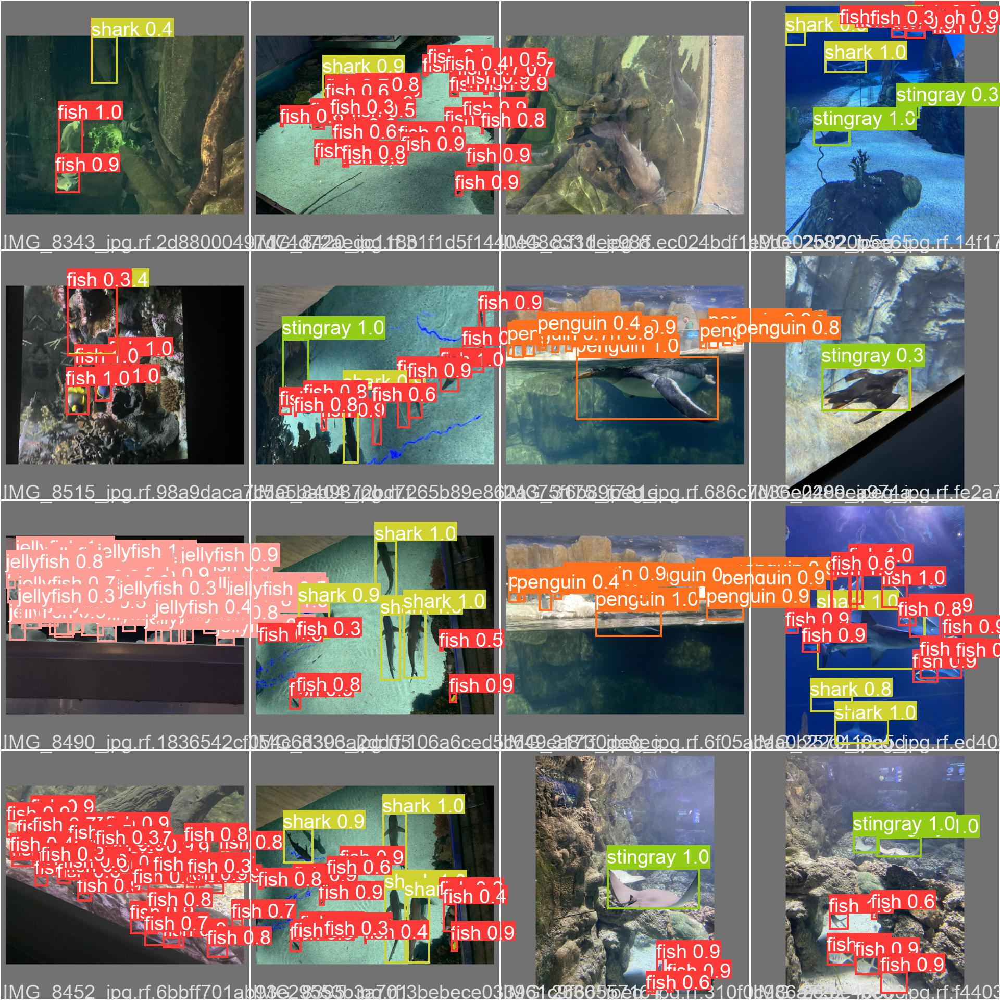

# YOLOv3 - Aquarium Dataset



The dataset is available at [roboflow](https://public.roboflow.com/object-detection/aquarium), and it has 7 classes. In the following image, we can see the number of objects in each class.


To download the dataset in the YOLO format, we use the following command:

```
./download_dataset.sh
```

To download the weights of the YOLO model, we use the following command:

```
./download_weights.sh
```

Make sure you to download the YOLOv3 code by running the following command:

```bash
git submodule update --init
```

After downloading the dataset and the weights, we can run the following command to detect objects with the YOLO model:

```bash
python yolov3/detect.py --source datasets/aquarium/test/images/ --weights weights/yolov3_aquarium.pt --project yolov3_aquarium --name detections
```

The output of the command is a folder named `yolov3_aquarium/detections`, which contains the detections of the test images.

## Training

To train the model, run the following command:

```bash
docker compose up train
```
or 

```bash
docker compose run yovov3 python yolov3/train.py --img 640 --batch 16 --epochs 300 --data data/aquarium.yaml --weights yolov3.pt --project runs/aquarium
```

The training was performed by fine-tuning the YOLOv3 model on the dataset. The best model in the validation set was chosen. The loss and evaluation metrics are shown below.



To apply the model to the validation set, run the following command:

```bash
docker compose up val
```
or

```bash
docker compose run yolov3 python yolov3/val.py --img 640 --batch 16 --data data/aquarium.yaml --weights weights/yolov3_aquarium.pt --project runs/aquarium-val
```

## Testing

To evaluate the model on the test set, run the following command:

```bash
docker compose up test
```
or

```bash
python yolov3/val.py --img 640 --batch 16 --data data/aquarium.yaml --weights weights/yolov3_aquarium.pt --task test --project runs/aquarium-test
```

We can see the the Precision-Recall curve and the confusion matrix below.





Here are some examples of the detections on the test set.




